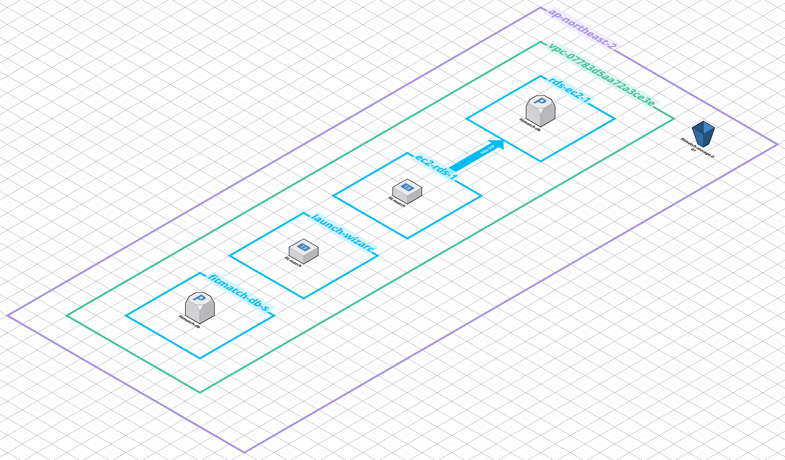
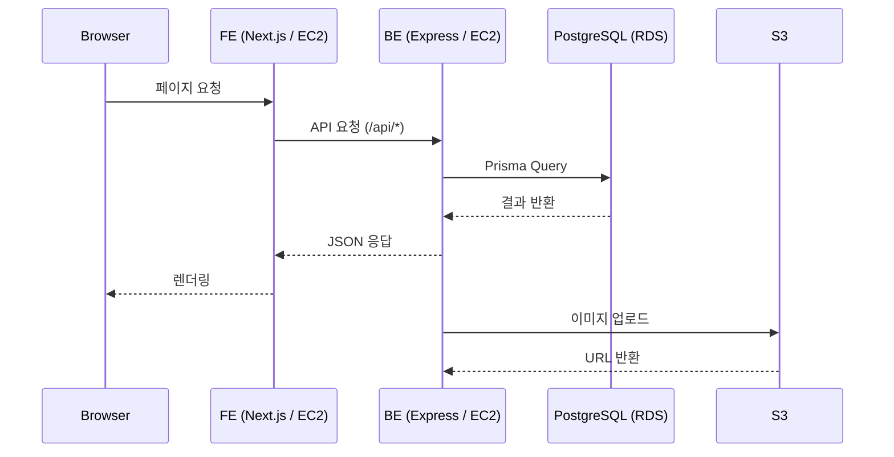

# FitMatch 🏋️

> 가까운 피트니스 센터의 수업을 쉽고 빠르게 예약하세요.

🌐 **서비스 URL**: https://fit-match.co.kr
🔗 **Backend Repository**: [fit-match-be](https://github.com/codeit-project-fitness-reservation/fs9-fitness-reservation-be)

## 목차

- [소개](#소개)
- [주요 기능](#주요-기능)
- [기술 스택](#기술-스택)
- [시스템 아키텍처](#시스템-아키텍처)
- [로컬 실행](#로컬-실행)
- [환경변수](#환경변수)
- [배포](#배포)

---

## 소개

FitMatch는 피트니스 센터와 고객을 연결하는 수업 예약 플랫폼입니다.
고객은 주변 센터를 지도로 탐색하고 원하는 수업을 간편하게 예약할 수 있으며,
셀러(강사/센터)는 수업 등록부터 스케줄 관리, 매출 정산까지 한 곳에서 처리할 수 있습니다.

---

## 주요 기능

### 👤 Customer
- 카카오맵 기반 주변 피트니스 센터 탐색
- 수업 목록 검색 · 필터 · 정렬
- 수업 예약 및 토스페이먼츠 포인트 결제
- 쿠폰 · 포인트 적용
- 예약 내역 확인 및 리뷰 작성

### 🏋️ Seller
- 수업 등록 및 이미지 업로드
- 주간 스케줄 기반 슬롯 자동 생성
- 예약 현황 조회 및 관리
- 매출 · 정산 내역 확인

### 🔧 Admin
- 수업 승인 / 반려
- 사용자 목록 조회 및 관리
- 포인트 · 쿠폰 수동 지급

---

## 기술 스택

| 구분 | 기술 |
|------|------|
| **FE Framework** | Next.js 16 (App Router), React 19 |
| **Language** | TypeScript 5 |
| **Styling** | Tailwind CSS 4 |
| **Form** | react-hook-form, Zod |
| **Calendar** | FullCalendar 6 |
| **Map** | Kakao Maps API |
| **Payment** | TossPayments SDK |
| **Package Manager** | pnpm |
| | |
| **BE Framework** | Express 5 |
| **Language** | TypeScript 5 (ESM) |
| **ORM** | Prisma 7 |
| **DB** | PostgreSQL (AWS RDS) |
| **Auth** | JWT (httpOnly Cookie) |
| **File Upload** | Multer (AWS S3) |
| **Test** | Jest, Supertest |
| | |
| **Infra** | AWS EC2, RDS, S3 (ap-northeast-2) |
| **Process Manager** | pm2 |
| **CI/CD** | GitHub Actions |

---

## 시스템 아키텍처



> AWS ap-northeast-2(서울) 리전 기준으로 VPC 내에 FE/BE EC2 인스턴스가 각각 분리되어 운영되며, RDS PostgreSQL과 S3 스토리지를 공유합니다.



---

## 로컬 실행

### 사전 요구사항
- Node.js 20+
- pnpm
- BE 서버 실행 중

### 설치 및 실행

```bash
# 의존성 설치
pnpm install

# 환경변수 설정
cp .env.example .env.local

# 개발 서버 실행 (port 3001)
pnpm dev
```

---

## 환경변수

| 변수명 | 설명 | 예시 |
|--------|------|------|
| `NEXT_PUBLIC_API_URL` | BE 서버 URL | `http://localhost:3000` |
| `NEXT_PUBLIC_KAKAO_MAP_API_KEY` | 카카오 지도 API 키 | `your_kakao_key` |
| `NEXT_PUBLIC_S3_IMAGE_HOST` | S3 이미지 호스트 | `your-bucket.s3.ap-northeast-2.amazonaws.com` |
| `NEXT_PUBLIC_TOSS_CLIENT_KEY` | 토스페이먼츠 클라이언트 키 | `test_ck_...` |

---

## 배포

GitHub Actions를 통해 `main` 브랜치에 push 시 자동 배포됩니다.

```
push to main
  ↓
pnpm install → lint → build (standalone)
  ↓
SCP → EC2 업로드
  ↓
SSH → tar 압축 해제 → pm2 restart fit-match-fe
```

> 서버 접속 정보 및 환경변수는 GitHub Secrets(`FE_ENV`, `EC2_HOST`, `EC2_USER`, `EC2_SSH_KEY`)로 관리됩니다.
