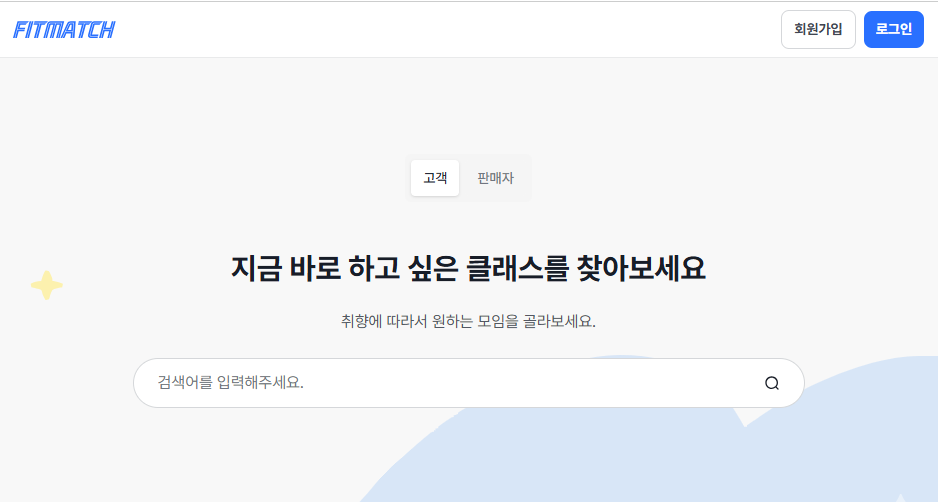
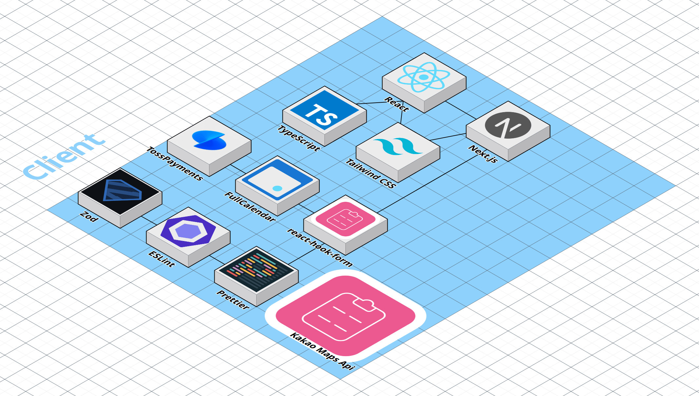
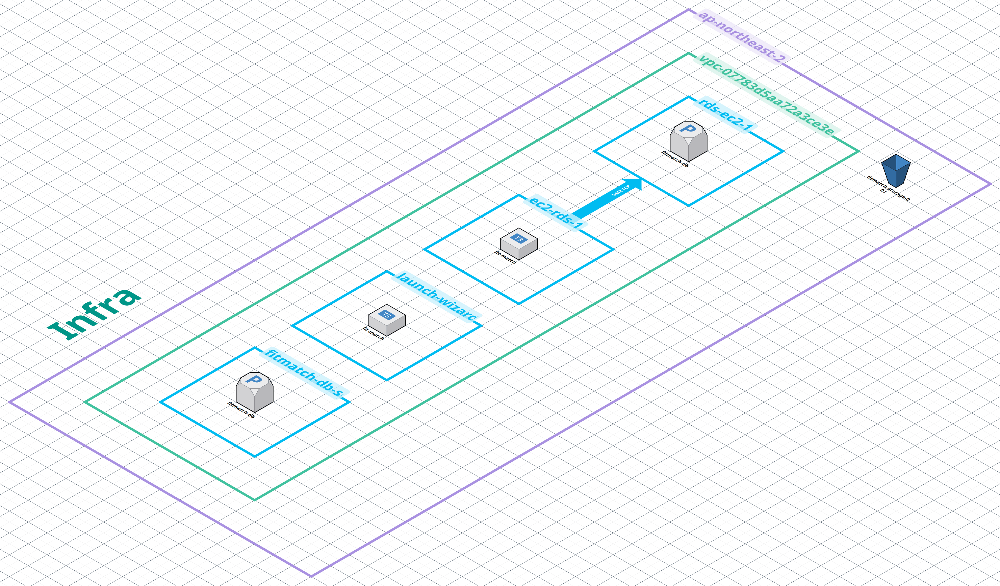

<div align="center">

<!-- 서비스 대표 이미지 -->



# 가까운 피트니스 센터의 수업을 🏋️ FitMatch로 예약하세요!

### [🏋️ FitMatch 바로가기 : https://fit-match.co.kr](https://fit-match.co.kr)

### [🔗 Backend Repository 바로가기](https://github.com/codeit-project-fitness-reservation/fs9-fitness-reservation-be)

</div>

<br>

## 목차

1. [프로젝트 소개](#1-프로젝트-소개)
2. [주요 기능](#2-주요-기능)
3. [기술 스택](#3-기술-스택)
4. [시스템 아키텍처](#4-시스템-아키텍처)
5. [팀 소개 및 문서](#5-팀-소개-및-문서)
6. [트러블 슈팅](#6-트러블-슈팅)
7. [폴더 구조](#7-폴더-구조)

---

## 1. 프로젝트 소개

- FitMatch는 피트니스 센터와 고객을 연결하는 수업 예약 플랫폼
- 고객은 지도를 통해 주변 센터를 탐색하고, 원하는 수업을 간편하게 예약 가능
- 포인트 결제 및 쿠폰 적용으로 합리적인 수업 이용 지원
- 셀러(센터)는 수업 등록부터 스케줄 관리, 매출 정산까지 한 곳에서 처리 가능
- 관리자는 수업 승인/반려, 회원,예약 관리 및 포인트·쿠폰 지급 등 플랫폼 운영 전반을 관리

---

## 2. 주요 기능

### 👤 Customer

| 기능 | 미리보기 |
| ---- | -------- |
| 카카오맵 기반 센터 탐색 | <!--  --> |
| 수업 예약 및 포인트 결제 | <!--  --> |
| 쿠폰 적용 | <!--  --> |
| 예약 내역 확인 및 리뷰 작성 | <!--  --> |

### 🏋️ Seller

| 기능 | 미리보기 |
| ---- | -------- |
| 수업 등록 및 이미지 업로드 | <!--  --> |
| 스케줄 기반 슬롯 자동 생성 | <!--  --> |
| 예약 현황 조회 | <!--  --> |
| 매출 · 정산 내역 확인 | <!--  --> |

### 🔧 Admin

| 기능 | 미리보기 |
| ---- | -------- |
| 수업 승인 / 반려 | <!--  --> |
| 포인트 · 쿠폰 수동 지급 | <!--  --> |

---

## 3. 기술 스택

#### ✅ Language


#### ✅ Framework & Library


#### ✅ External API


#### ✅ Dev Tool


#### ✅ Deployment


---

## 4. 시스템 아키텍처

### Client




### Infra



---

## 5. 팀 소개 및 문서

### [📋 Team Notion 바로가기](https://www.notion.so/2e8f454c3ce481b69b26d3fb4da6e481?v=2e8f454c3ce481f381ec000c4ebf9ac3)

| 이정윤 | 박지은 | 최진영 | 백수현 |
| :---: | :---: | :---: | :---: |
| [](https://github.com/jyoon00-cloud) | [](https://github.com/jieun318) | [](https://github.com/Gephigirl) | [](https://github.com/bean-baek) |
| 팀장 | 팀원 | 팀원 | 팀원 |
| [📄 개인 개발 리포트](https://www.notion.so/313f454c3ce48073aebfe328e0962d74) | [📄 개인 개발 리포트](https://www.notion.so/312f454c3ce480628dabed2bb290b590) | [📄 개인 개발 리포트](https://www.notion.so/313f454c3ce480268bcdf84fbe5a2e6d) | - |
| 어드민 페이지 UI/UX 구현<br>CI/CD 및 배포 환경 구성 <br> 배포 후 전반적 수정 | 프로젝트 초기 설정 및 디자인 시스템 구축<br>셀러 페이지 UI/UX 구현<br>클래스 상세 페이지 구현<br>공통 헤더/레이아웃 컴포넌트 구현<br>API 연동 | 고객 페이지 UI/UX 구현<br>마이페이지 신규 생성<br>시설 탐색 및 예약 화면 UI 구성<br>API 연동 | 인증 구현<br>Cookie 기반 토큰 관리<br>알림(Notification) 기능 구현 |

---

## 6. 트러블 슈팅

<!-- 겪었던 주요 이슈들을 아래 형식으로 작성해주세요 -->

<details>
<summary><strong>[ 트러블 슈팅 제목 ]</strong></summary>

### Problem

- 문제 상황 설명

### Solution

- 해결 방법 설명

</details>

---

## 7. 폴더 구조

```
📦 src/
├── 📁 app/                   # Next.js App Router 페이지
│   ├── 📁 (auth)/            # 인증 관련 페이지
│   ├── 📁 (customer)/        # 고객 페이지
│   ├── 📁 (seller)/          # 셀러 페이지
│   ├── 📁 (admin)/           # 관리자 페이지
│   └── 📁 api/               # API Route Handler
├── 📁 components/            # 공용 UI 컴포넌트
├── 📁 hooks/                 # 커스텀 훅
├── 📁 lib/                   # API 클라이언트, 유틸리티
├── 📁 types/                 # 타입 정의
└── 📁 utils/                 # 공용 함수
```

</details>
