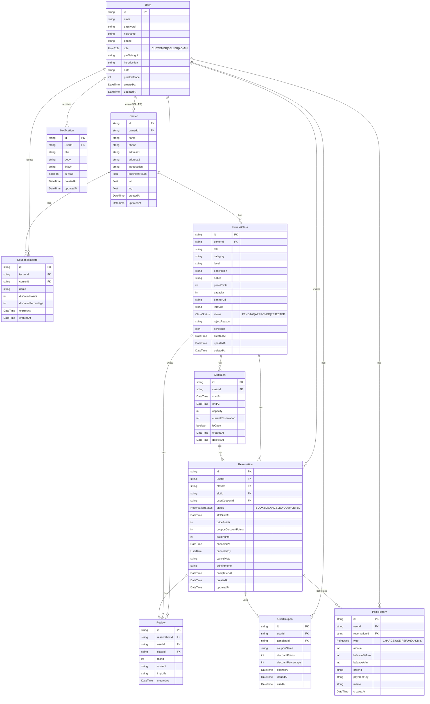

<div align="center">

<!-- 서비스 대표 이미지 -->


# 가까운 피트니스 센터의 수업을 🏋️ FitMatch로 예약하세요!

### [🏋️ FitMatch 바로가기 : https://fit-match.co.kr](https://fit-match.co.kr)

### [📚 API 명세서 바로가기](https://github.com/codeit-project-fitness-reservation/fs9-fitness-reservation-be/blob/main/api.md)

### [🔗 Frontend Repository 바로가기](https://github.com/codeit-project-fitness-reservation/fs9-fitness-reservation-fe)

### [🔗 Backend Repository 바로가기](https://github.com/codeit-project-fitness-reservation/fs9-fitness-reservation-be)

</div>

<br>

## 목차

1. [프로젝트 소개](#1-프로젝트-소개)
2. [주요 기능](#2-주요-기능)
3. [주요 API](#3-주요-api)
4. [기술 스택](#4-기술-스택)
5. [시스템 아키텍처](#5-시스템-아키텍처)
6. [DB 스키마](#6-db-스키마)
7. [팀 소개 및 문서](#7-팀-소개-및-문서)
8. [트러블 슈팅](#8-트러블-슈팅)
9. [폴더 구조](#9-폴더-구조)

---

## 1. 프로젝트 소개

- FitMatch는 피트니스 센터와 고객을 연결하는 수업 예약 플랫폼
- 고객은 카카오맵을 통해 주변 센터를 탐색하고, 원하는 수업을 간편하게 예약 가능
- 토스페이먼츠 기반 포인트 결제 및 쿠폰 적용으로 합리적인 수업 이용 지원
- 셀러(센터)는 수업 등록부터 스케줄 관리, 매출 정산까지 한 곳에서 처리 가능
- 관리자는 수업 승인/반려, 회원·예약 관리, 포인트·쿠폰 지급, 회원 메모 등 플랫폼 운영 전반을 관리

---

## 2. 주요 기능

### 👤 Customer

| 기능 | 미리보기 |
| ---- | -------- |
| 카카오맵 기반 센터 탐색 | <!--  --> |
| 수업 예약 및 포인트 결제 | <!--  --> |
| 쿠폰 적용 | <!--  --> |
| 예약 내역 확인 및 리뷰 작성 | <!--  --> |

### 🏋️ Seller

| 기능 | 미리보기 |
| ---- | -------- |
| 수업 등록 및 이미지 업로드 | <!--  --> |
| 스케줄 기반 슬롯 자동 생성 | <!--  --> |
| 예약 현황 조회 | <!--  --> |
| 매출 · 정산 내역 확인 | <!--  --> |

### 🔧 Admin

| 기능 | 미리보기 |
| ---- | -------- |
| 수업 승인 / 반려 | <!--  --> |
| 포인트 · 쿠폰 수동 지급 | <!--  --> |

---

## 3. 주요 API

| 영역 | 설명 |
|------|------|
| **Auth** | 회원가입, 로그인, 토큰 갱신, 프로필 조회/수정 |
| **User** | 관리자 회원 목록/상세, 회원 메모 수정 |
| **Center** | 센터 CRUD, 지오코딩 |
| **Class** | 수업 CRUD, 슬롯, 승인/반려 |
| **Reservation** | 예약 생성/취소/완료, 고객·판매자·관리자 조회 |
| **Point** | 포인트 잔액/내역, 충전(토스 승인), 정산 |
| **Coupon** | 쿠폰 템플릿, 발급 |
| **Review** | 리뷰 CRUD |
| **Notification** | 알림 목록, 읽음 처리, SSE |

상세: [API 명세서](./api.md)

---

## 4. 기술 스택

### Frontend

#### ✅ Language


#### ✅ Framework & Library


#### ✅ External API


#### ✅ Dev Tool


#### ✅ Deployment


---

### Backend

#### ✅ Language


#### ✅ Framework & Library


#### ✅ Database


#### ✅ Deployment


#### ✅ Dev Tool


---

## 5. 시스템 아키텍처

### Client


### Server


### Infra


---

## 6. DB 스키마



---

## 7. 팀 소개 및 문서

### [📋 Team Notion 바로가기](https://www.notion.so/2e8f454c3ce481b69b26d3fb4da6e481?v=2e8f454c3ce481f381ec000c4ebf9ac3)

| 이정윤 | 박지은 | 최진영 | 백수현 |
| :---: | :---: | :---: | :---: |
| [](https://github.com/jyoon00-cloud) | [](https://github.com/jieun318) | [](https://github.com/Gephigirl) | [](https://github.com/bean-baek) |
| 팀장 | 팀원 | 팀원 | 팀원 |
| [📄 개인 개발 리포트](https://www.notion.so/313f454c3ce48073aebfe328e0962d74) | [📄 개인 개발 리포트](https://www.notion.so/312f454c3ce480628dabed2bb290b590) | [📄 개인 개발 리포트](https://www.notion.so/313f454c3ce480268bcdf84fbe5a2e6d) | - |
| **[FE]** 어드민 페이지 UI/UX 구현<br>CI/CD 및 배포 환경 구성<br>배포 후 전반적 수정<br>**[BE]** 프로젝트 초기 설정·Prisma 스키마<br>센터·클래스·예약·리뷰·포인트·쿠폰·회원 API<br>토스페이먼츠 결제 승인·정산<br>CI/CD 및 BE 배포 등 그 외 전반 | **[FE]** 프로젝트 초기 설정 및 디자인 시스템 구축<br>셀러 페이지 UI/UX 구현<br>클래스 상세 페이지 구현<br>공통 헤더/레이아웃 컴포넌트 구현<br>API 연동 | **[FE]** 고객 페이지 UI/UX 구현<br>마이페이지 신규 생성<br>시설 탐색 및 예약 화면 UI 구성<br>API 연동 | **[FE]** 인증 구현<br>Cookie 기반 토큰 관리<br>알림(Notification) 기능 구현<br>**[BE]** 인증·JWT·Cookie 기반 세션<br>회원가입/로그인/프로필 API<br>알림(Notification)·SSE API |

---

## 8. 트러블 슈팅

<!-- 핵심 트러블슈팅 사례 -->

### Frontend

<details>
<summary><strong>[이정윤] 카카오 지도 비동기 렌더링 경쟁 상태 해결</strong></summary>

### Problem
- 외부 SDK(Kakao Map)가 전부 로드되기 전에 빠른 속도로 실행된 리액트 컴포넌트 마운트 사이클이 빈 지도 인스턴스를 초기화하려 시도, 이로 인해 지도가 빈 화면으로 노출되거나 깨지는 경쟁 상태 발생.

### Solution
- 지도 초기화 로직을 단순히 `useEffect`에 맡기지 않고, 외부 스크립트 태그의 `onLoad` 이벤트 리스너와 렌더링 상태를 동기화하여 스크립트 응답 상태 감지.
- 무거운 외부 I/O 타이밍에 의존적인 로직에서, 로딩 완료가 100% 보장된 시점에만 순차적으로 렌더 사이드 이펙트를 통제하도록 개선.
</details>

<details>
<summary><strong>[박지은] 대시보드 일정 캘린더 간헐적 비어 보임 / 화이트아웃</strong></summary>

### 증상
- 대시보드 진입 시 일정 캘린더가 간헐적으로 비어 보이거나, 데이터 형식 오류로 인해 전체 UI가 화이트아웃되는 현상 발생.

### 원인
1. **데이터 폴리모피즘:** API의 `schedule` 필드가 문자열, 객체, null 등 일관되지 않은 포맷으로 반환되어 런타임 에러 유발.
2. **하이드레이션 타이밍:** 서버와 클라이언트 간의 스케줄 계산 시점 차이로 인해 초기 렌더링 시 빈 배열이 주입됨.

### 해결
1. **방어적 프로그래밍:** `ClassItem & { schedule?: string | Record<string, string> | null }` 타입 캐스팅 및 `parseSchedule` 내부에 예외 처리 로직을 추가하여 데이터 형식이 깨져도 안정성을 유지하도록 개선.
2. **Lifecycle Guard 도입:** `mounted` 상태와 `isLoading` 플래그를 결합한 조건부 렌더링을 적용, 데이터 계산이 완료된 시점에만 UI를 노출하도록 제어.
</details>

### Backend

<details>
<summary><strong>[이정윤] 쿠폰 템플릿-사용자 쿠폰 디커플링 (데이터 무결성)</strong></summary>

### Problem
- 관리자가 발급한 '쿠폰 템플릿'을 수정·삭제할 경우, 이미 발급된 `UserCoupon`의 할인 정보까지 연쇄적으로 변경되거나 유실되는 강한 결합(Coupling) 문제가 발생할 위험.

### Solution
- 쿠폰 발급 시점의 할인율과 만료일을 `UserCoupon` 엔티티 내에 별도의 스냅샷(Snapshot) 형태로 저장하도록 구조 분리(Decoupling).
- 이를 통해 원본 템플릿 변동과 무관하게 사용자의 혜택 정보를 안전하게 보장하는 아키텍처 설계 구현.
</details>

<details>
<summary><strong>[이정윤] 관계형 DB 참조 무결성과 Soft Delete 도입</strong></summary>

### Problem
- 부모 엔티티(`Class`) 삭제 시, 이를 강하게 참조하고 있는 하위 테이블(`ClassSlot` 등)의 제약조건 때문에 물리적 DB 연산이 실패하는 참조 무결성 에러 발생.

### Solution
- 연쇄 삭제나 물리적 삭제의 위험성을 피해, `deletedAt` 필드를 활용한 논리적 삭제(Soft Delete) 패턴 도입.
- DB 히스토리를 보존하면서 물리 삭제 에러를 우회하고 논리적 정합성을 유지.
</details>

---

## 9. 폴더 구조

### Frontend

```
📦 src/
├── 📁 app/                   # Next.js App Router 페이지
│   ├── 📁 (auth)/            # 인증 관련 페이지
│   ├── 📁 (customer)/        # 고객 페이지
│   ├── 📁 (seller)/          # 셀러 페이지
│   ├── 📁 (admin)/           # 관리자 페이지
│   └── 📁 api/               # API Route Handler
├── 📁 components/            # 공용 UI 컴포넌트
├── 📁 hooks/                 # 커스텀 훅
├── 📁 lib/                   # API 클라이언트, 유틸리티
├── 📁 types/                 # 타입 정의
└── 📁 utils/                 # 공용 함수
```

### Backend

```
📦 src/
├── 📁 config/                # 환경변수, Prisma 클라이언트
├── 📁 middlewares/           # 인증, 에러 핸들러, 로거, 업로드, 유효성 검사
├── 📁 modules/
│   ├── 📁 auth/              # 회원가입, 로그인, 토큰 갱신, 프로필
│   ├── 📁 center/            # 센터 CRUD
│   ├── 📁 class/             # 수업 CRUD, 슬롯 관리, 통계
│   ├── 📁 coupon/            # 쿠폰 템플릿, 발급
│   ├── 📁 notification/      # 알림, SSE 실시간 스트림
│   ├── 📁 point/             # 포인트 내역, 충전, 정산
│   ├── 📁 reservation/       # 예약 생성/취소/완료
│   ├── 📁 review/            # 리뷰 CRUD
│   └── 📁 user/              # 어드민 유저 관리
├── 📁 tests/
│   └── 📁 integration/       # E2E 통합 테스트
├── 📁 types/                 # 공통 타입
└── 📁 utils/                 # 파일 업로드 유틸
📦 prisma/
├── 📄 schema.prisma
├── 📁 migrations/
├── 📄 seed.ts                # 개발용 시드 데이터
└── 📄 seed.production.ts
```
